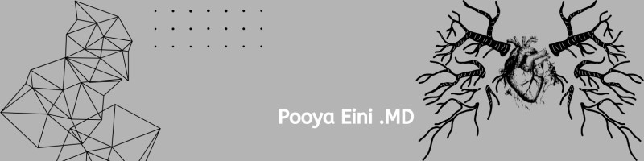

### 👋 About me

I'm a **physician-researcher** focused on **cardiovascular medicine, cardiac imaging, and clinical AI**. My work centers on developing and evaluating machine-learning models for diagnosis and prognosis — particularly in echocardiography and ultrasound-based cardiovascular assessment — models that are accurate, well-calibrated, validated, and genuinely useful at the bedside.

---

🏥 **Research Assistant** at Shaheed Rajaie Cardiovascular Medical & Research Center, Tehran, Iran  
🎓 **MD**, Shahid Beheshti University of Medical Sciences (2017–2024)  
🔬 **Research focus:** cardiac imaging AI (echocardiography, ultrasound, cardiac CT, CMR), risk prediction for heart failure/stroke/valvular disease, ML model evaluation & external validation, evidence synthesis & meta-analysis of AI-based diagnostic/prognostic models  
🧰 **Core skills:** systematic review & meta-analysis, diagnostic test accuracy synthesis, clinical prediction modeling, discrimination/calibration assessment, statistical analysis in R, reproducible research workflows  
📈 **250+ citations** · **h-index 10** · **60+ publications**  
🌐 **More at [pooyaeini.github.io](https://pooyaeini.github.io/)**

### 🛠️ Tech stack

### 🚀 Featured projects

| Project | Description | Stack | Stars |
|---------|-------------|-------|-------|
| **[catheterization-ML](https://github.com/pooyaeini/catheterization-ML)** | Catheterization prediction using ML models — clinical decision support for invasive cardiac procedures | Python, scikit-learn, XGBoost, SHAP | ⭐⭐  |
| **[Right-Ventricular-Dysfunction-in-Acute-Pulmonary-Embolism](https://github.com/pooyaeini/Right-Ventricular-Dysfunction-in-Acute-Pulmonary-Embolism)** | ML pipeline predicting RV dysfunction in acute pulmonary embolism from clinical & imaging data | Python, PyTorch, scikit-learn, echocardiography | ⭐⭐  |
| **[vitaldb-arrhythmia-hrv-ml](https://github.com/pooyaeini/vitaldb-arrhythmia-hrv-ml)** | HRV/ML pipeline predicting intraoperative arrhythmia onset from VitalDB arrhythmia database annotations | Python, HRV analysis, PyTorch, scikit-learn | ⭐⭐⭐  |
| **[lab-data-extractor](https://github.com/pooyaeini/lab-data-extractor)** | AI-based laboratory data extraction from clinical documents | Python, NLP, OCR, LLMs | ⭐⭐⭐  |
| **[zzu-pecg-cvd-ml](https://github.com/pooyaeini/zzu-pecg-cvd-ml)** | Interpretable ML detection of cardiovascular disease from structured pediatric ECG reports (ZZU-pECG) | Python, scikit-learn, SHAP, interpretability | ⭐⭐  |

### 📊 Contribution graph

